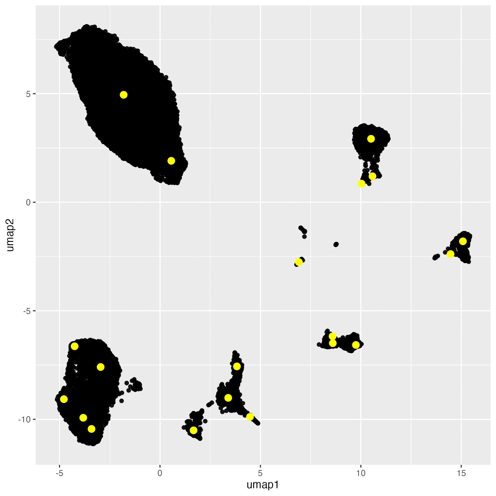

# Cluster stability

## Introduction

This is a project that simply questions how much clusters "move around" when you run a given algorithm over and over on your data. The wording I see for this kind of question is "cluster stability."

This project makes a visual solution to this type of inquiry. We focus on CyTOF data. We cluster with FlowSOM, and we run it over and over again. We run UMAP for visualization. For each clustering scheme, we calculate the cluster centroids. We then plot the centroids directly on the UMAP that we created, and we do this for each clustering scheme.

We then turn this into a gif. To make the gif easier on the eyes, we order the images by similarity (which is an approximation of similarity of clustering schemes). 

## How to use

First, use the code in cluster_centroid_with_bootstrap.Rmd to produce the images. The markdown has explanation and example data. Then, use the code in image_ordering to order the images by similarity and produce the gif.

## Example

Below is an example of the type of image that you get. The spoiler alert after seeing this is that you should aim to overcluster your data rather than trying to get it just right.

